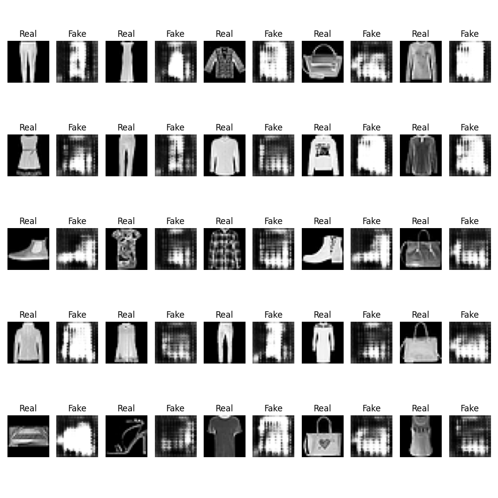

# Conditional Generative Adversarial Networks (cGAN)

This repository contains an implementation of Conditional Generative Adversarial Networks (cGAN) as described in the paper [Conditional Generative Adversarial Nets](https://arxiv.org/abs/1411.1784).

## Overview

Conditional GANs are an extension of GANs where both the generator and discriminator are conditioned on some extra information. This extra information could be class labels or data from other modalities. By conditioning the model on additional information, cGANs can generate more targeted and relevant outputs.

## Features

- Implementation of cGAN using PyTorch
- Training and evaluation scripts
- Example usage with MNIST dataset

## Requirements

- Python 3.6+
- PyTorch 1.7+
- torchvision
- numpy
- matplotlib


## Installation

Clone this repository and install the required dependencies:

```bash
git clone https://github.com/yourusername/Conditional-Generative-adversarial-Networks.git
cd Conditional-Generative-adversarial-Networks
pip install -r requirements.txt
```

## Usage

### Training & Evaluation

To train the cGAN model, run the following command:

```bash
python train.py 
```


## Results

Here are some example results generated by the cGAN model:




## References

- [Conditional Generative Adversarial Nets](https://arxiv.org/abs/1411.1784)


## Acknowledgements

This implementation is inspired by the original paper and various open-source implementations available online.
